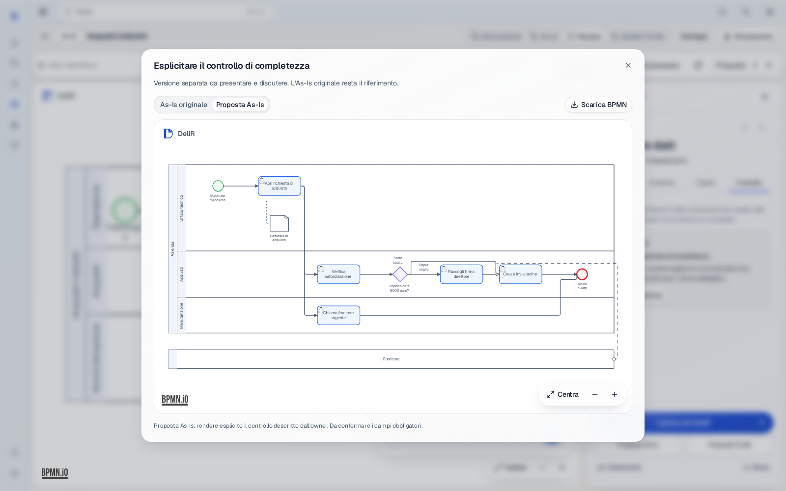
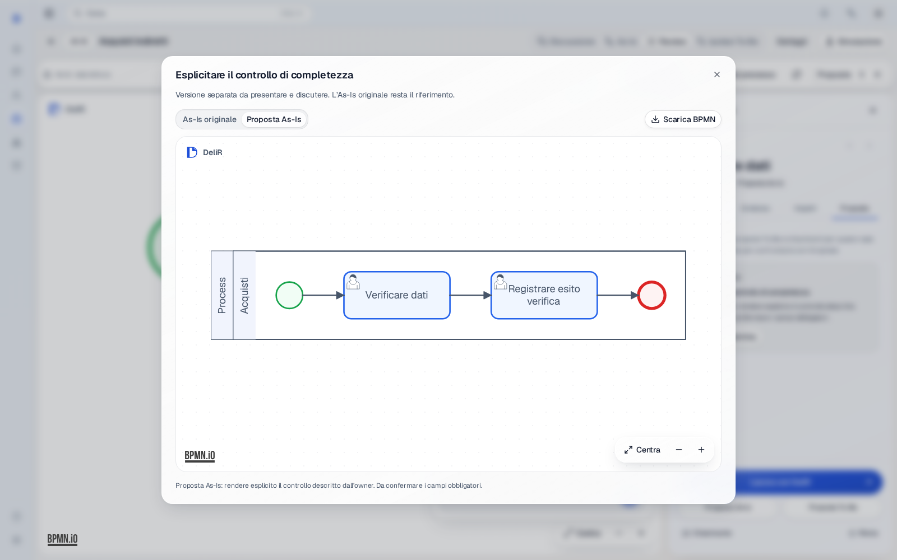
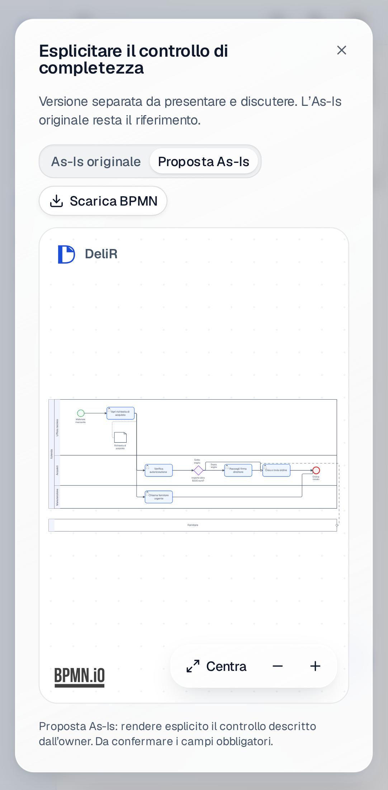

# DeliR CanvasLayoutPolicy

Agents edit process meaning. DeliR owns diagram geometry.

`Agent → semantic BPMN → normalizer → graph/lane layout → visual lint → regenerated BPMN DI → bpmn-js`

The current grammar is `delir-compact-v2`; density, product identity, rendered
text checks and the limits of the NLP quality claim are documented in
[Compact DeliR canvas](delir-canvas-identity.md).

The entrypoint is `backend.bpmn.canvas_layout.apply_enterprise_layout`. Compilers,
canvas editing helpers, construction tools, the drawing subgraph and Review
proposals use it. A second guard at model persistence checks the runtime actor:
an agent cannot bypass the policy by supplying raw XML or the default save source.
Agent restores also regenerate DI. Model XML, version snapshots and tool state
use the actual persisted result.

The previous serializer layout and row-based layout implementation have been
removed. The drawing subgraph no longer calls an LLM to choose rows or spacing.
Legacy Python layout keywords are accepted for source compatibility and do not
control output; they are absent from the agent tool schemas.

## Product grammar

- Incoming DI is discarded. IDs, ownership, conditions, event declarations,
  documents, notes and provenance remain semantic authority.
- A role is a lane. Existing participants remain pools. When a process with lanes
  has no participant, its process name supplies the single process boundary.
  Unknown ownership does not create invented roles.
- Sequence flow topology supplies stable left-to-right ranks. XML child order
  and previous coordinates cannot choose visual order. End events occupy the
  final rank; feedback loops use return channels.
- Lane order follows first involvement. Ties use incoming flow IDs and lane IDs.
  Simultaneous branches share a rank and symmetric vertical tracks before joins.
- Subprocess internals remain semantic authority; the agent policy renders the
  subprocess collapsed. Manual expanded subprocess DI is preserved and validated.
- Task sizes and spacing come from the frozen product policy. Artifact space and
  boundary attachments follow semantic relationships.
- Deterministic orthogonal routing avoids nodes and labels. Candidate routes and
  an obstacle-corner search penalize crossings; branch labels have explicit DI.
- Visual lint blocks missing or duplicate shapes/sequence edges, invalid bounds,
  overlapping elements/text, missing document or participant connectors, owner or
  pool containment violations, diagonal
  agent routes and connections through unrelated nodes or labels. Residual
  crossings are reported. This custom graph engine does not claim globally
  optimal routing for every possible graph.

## Manual work

Consultant saves and restores preserve supplied DI. Existing diagrams are
validated without regeneration. Invalid bounds, overlaps, owner containment
violations and connections through nodes reject the save atomically. Diagonal
manual routes and text concerns are diagnostics rather than automatic changes.
Legacy records with no diagram remain readable. A later agent mutation applies
the mandatory policy to the resulting proposal/model, including previously
manual geometry.

## Verification

Tests cover ignored agent DI, deterministic ranks and idempotence, real-owner
lanes, symmetric branches, loops, boundary events, invalid semantic references,
QName-only namespace preservation, event child order, and actor-aware writes and
restores on isolated Postgres. Existing topology/compiler tests retain coverage
of conditions, data, events, traceability and exceptions.

The actual LangGraph Review tool creates the committed `review-agent` BPMN
artifacts; Playwright imports those exact bytes, checks visible nodes and painted
paths and compares the exported BPMN. A separate policy-generated purchase
artifact verifies three owner lanes, process/external pools, documents and
branch labels in the product viewer on desktop and mobile Chromium. Browser
review responses are mocked; these checks do not prove an arbitrary natural
language request will produce correct business semantics.

## Database integration

Review proposals and simulation run logs arrived through independent `0030`
revisions. `0031_merge_review_simulation` reunites their histories without
renaming published revisions or changing schema. Upgrade and downgrade/re-upgrade
were verified on isolated Postgres from a fresh database and from either branch.

The concurrent integration of PR #97 published a second merge revision,
`0031_merge_0030_heads`. `0032_merge_layout_heads` preserves both published
histories and restores the single head; it contains no schema DDL.
