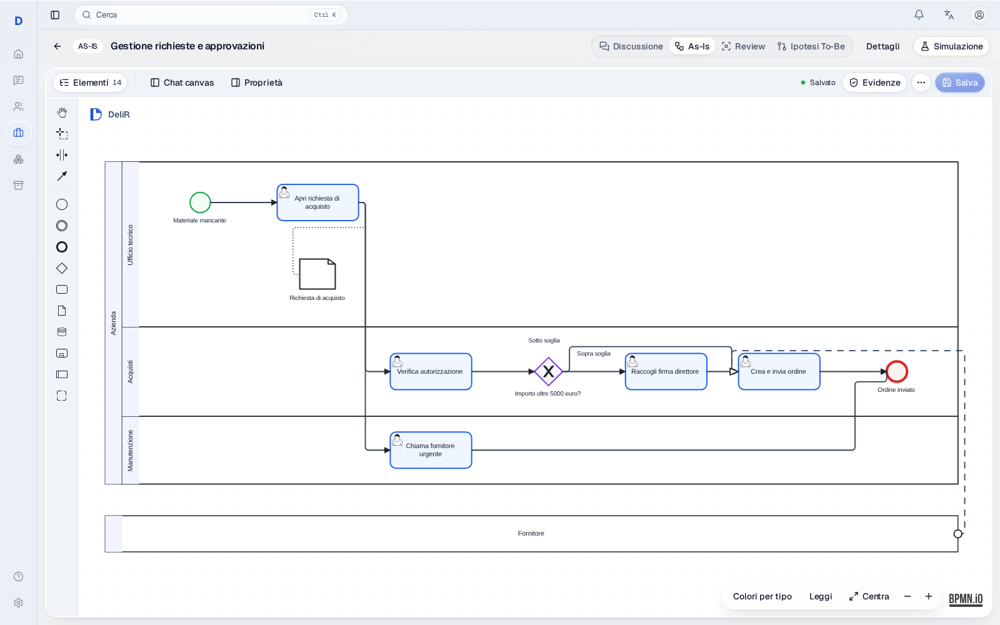
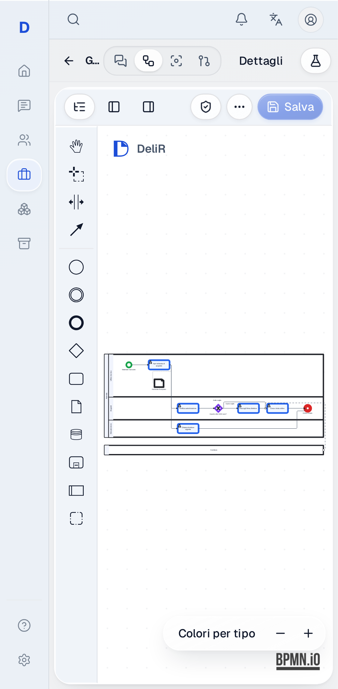

# Compact DeliR canvas

AI-generated diagrams use the global `delir-compact-v2` policy. Product geometry
is compulsory for every agent write; consultant geometry remains preserved and
validated. These changes do not grant an agent control over presentation.

## Density and readable text

Activity defaults are 144×64, with 56-unit column gaps and 28-unit content
padding. Lane height follows its actual nodes, labels, documents, boundary
events and loop channels. An explicitly modelled but unused role is retained as
a 56-unit band. External black-box participants use 64-unit bands. No roles,
tasks, documents or participant relationships are deleted to make a drawing fit.

Verbose NLP activity names grow the task height; sibling tracks reserve that
height before placement. Branch labels search nearby positions along their
route when the midpoint is occupied, with the same collision and containment
checks. The facility golden case exercises this dense placement regression.
Branch labels prefer nearby clear placements and cannot touch lane dividers;
the visual linter independently enforces this for agent diagrams. A consultant's
text on a divider is reported as a diagnostic without changing manual geometry.

The purchase fixture's process pool shrank from 1740×670 to 1508×570. Its three
roles, decision branches, document, boundary and supplier message remain intact.
Viewport framing uses 48-unit margins rather than 140 horizontal / 120 vertical
margins. A complete overview can still be zoomed and panned on a phone.

The browser checks actual rendered label bounds against activity rectangles.
SVG `geometricPrecision` prevents small-zoom mobile glyph rounding from pushing
labels outside their shapes. Review loads the UI font before measuring text.

## Product identity

Editor and Review share the existing `domain-process-*` semantic palette from
main: human tasks, automation, decisions, starts and ends retain distinct types.
Explicit imported DI colours take precedence; the colour toggle remains usable.
Evidence/provenance and selected/upstream/downstream outlines take precedence
over type outlines. None of the presentation markers changes saved BPMN XML.

The folded-D mark echoes the Review companion and accompanies the DeliR
wordmark. A quiet token-based grid and tinted role headers frame the canvas.
Both added semantic tokens resolve through the existing primitives; no new
colour literals or independent palette were introduced. Headers update from
the current registry and leave the structural BPMN outline and labels intact.

Visual references inspected: [ProcessMind's modeling canvas](https://processmind.com/resources/docs/modeling/modeling-canvas)
and [Camunda's contextual modeling controls](https://camunda.com/blog/2024/02/model-faster-simplified-modeling-canvas/).
Their useful patterns are a restrained workspace, contextual actions and stable
navigation; DeliR retains its own palette, typography and companion.

The installed bpmn-js license requires its watermark to remain fully visible.
It is preserved and unobstructed. Removing it requires appropriate licensing
or replacement of the renderer, not a CSS hiding rule.

## What the quality numbers mean

The reproducible geometry corpus passes 100/100 varied cases with topology and
owner preservation, finite geometry, visual lint and idempotence. Additional
tests cover verbose task names and real empty roles. Existing golden compiler
and control-flow tests also pass. Review's actual LangGraph tool output is
persisted, imported by the browser and checked for new tasks, owners, painted
connections and exported BPMN. Browser conversations use controlled responses.

These results do not establish 99% semantic accuracy for arbitrary NLP.
The existing live evaluation entrypoint is
`tests/evals/l1_golden/test_golden_set.py`: interviews → extraction → compilation
→ reference graph and provenance metrics. It requires a dedicated test provider
(`DELIR_TEST_LLM_BASE_URL`, `DELIR_TEST_LLM_API_KEY`, `DELIR_TEST_LLM_MODEL`), which
was not configured in this execution environment. No production provider was
silently used in its place.

Before claiming a 99% production success rate, define success as all required
activities, owners, conditions, exceptions and evidence surviving without
invented facts, plus a passing rendered layout. Evaluate representative NLP
cases against consultant-validated references on the production model/config.
For example, zero failures in at least 299 independent representative trials
would support a one-sided 95% lower confidence bound above 99%; a hand-built
geometry corpus is not such a sample. Report failures and consultant corrections
as well as the aggregate score. Unknown evidence must remain an explicit gap.

## Product screenshots

