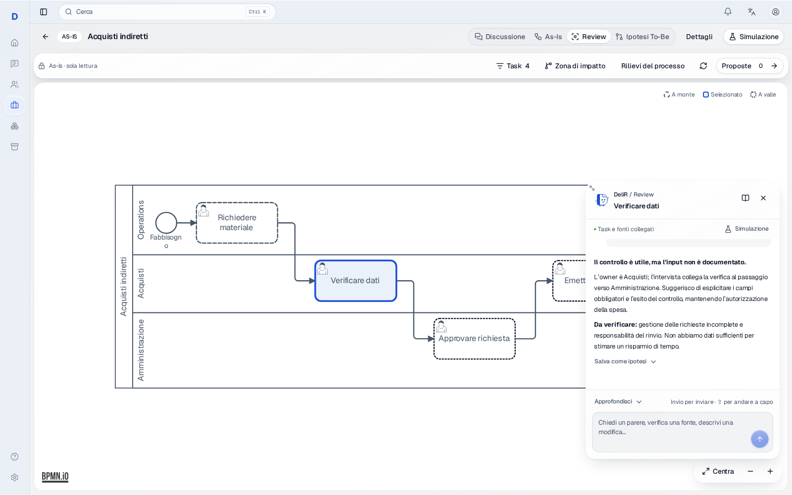

# Process Review — agente contestuale sul canvas

La Review è lo spazio di lavoro tra comprensione As-Is e trasformazione To-Be.
Il consulente può leggere il processo, chiedere un parere motivato, approfondire
fonti e dipendenze e far preparare diagrammi separati da presentare.

## Interazione

Selezionare un task aggancia la mascotte DeliR al nodo. La chat parte chiusa e
si apre al clic sulla mascotte. Il canvas conserva zoom e posizione. La striscia
di task al piede è stata rimossa; resta una lista con ricerca, accessibile da
tastiera, per selezionare anche i task fuori dall'inquadratura.

La chat consente testo libero, risposte in streaming, interruzione e retry.
Conversazioni e bozze sono distinte per task: una risposta tardiva non compare
nella conversazione del task successivo. Chiudere la chat restituisce il focus
alla mascotte. L'angolo superiore sinistro ridimensiona larghezza e altezza,
anche da tastiera: frecce per muovere l'angolo, Home per ripristinare. Le dimensioni
rimangono durante selezione di altri task e riapertura, entro lo spazio del canvas.

Le scorciatoie sono inviti, non un elenco chiuso di funzioni. Si può chiedere di:

- Ricostruire owner, input, output, regole, documenti ed eccezioni.
- Verificare fonti, citazioni, lacune e contraddizioni.
- Dare un parere e confrontare alternative, handoff, controlli e automazione.
- Preparare domande per l'owner e un piano di verifica.
- Leggere simulazioni registrate, distinguendo risultati misurati da ipotesi.
- Modificare un diagramma in una proposta As-Is o To-Be separata.

Il pulsante Conoscenza apre il pannello destro su richiesta. Le viste sono
Conoscenza, Evidenze, Impatti e Proposte. Il footer consente di lavorare con
DeliR, preparare una proposta As-Is/To-Be, registrare un chiarimento o rinviare
un punto. Chiedere una proposta dal footer precompila una richiesta modificabile
nella chat; il consulente decide cosa inviare.

## Proposte da presentare

Una risposta può diventare un'ipotesi testuale As-Is o To-Be, con titolo e testo
modificabili prima della registrazione. Su richiesta esplicita di modificare il
diagramma, l'agente può creare una versione BPMN separata e poi revisionarla.
Gli strumenti supportano aggiunta/eliminazione di attività, etichette, note,
assegnazione a lane, collegamento/ricollegamento dei flussi e ridisegno del layout.

Le proposte con diagramma si aprono dal pannello destro o dal registro. Si può
alternare proposta e As-Is originale e scaricare un file `.bpmn` da presentare.
Il registro distingue correzioni alla rappresentazione As-Is da ipotesi To-Be.
L'originale e il piano canonico non vengono sostituiti dalla Review.

## Conoscenza, scope e persistenza

La chat usa le sessioni e lo stream esistenti, con una chiave dedicata al task.
Il backend verifica tenant, progetto, processo, modello, task e revisione prima
di aprire una sessione o accettare il messaggio. Il grafo Review ha strumenti
propri e non passa dal percorso canvas che può ricostruire il piano.

Gli identificativi degli strumenti sono iniettati dal runtime: l'LLM non sceglie
un altro processo. L'agente legge snapshot, semantica, relazioni, gap,
tracciabilità, diagrammi e risultati registrati. Le proposte riusano il motore
BPMN deterministico. Le operazioni vengono applicate a una copia; soltanto una
proposta valida viene registrata. Una modifica della base durante il lavoro
viene rifiutata alla scrittura. Non vengono avviate nuove simulazioni dalla chat:
si preparano gli input e si apre la superficie Simulazione esistente.

Owner, input e output del pannello derivano dai riferimenti esatti del
compilatore verso il piano; l'owner può provenire dalla lane BPMN. Le dipendenze
seguono rami, gateway e cicli. Questo perimetro strutturale non è una previsione
di performance. Dati mancanti e limiti delle evidenze restano espliciti.

`GET /v1/workspace/processes/{id}/impact-review` legge base e registro;
`POST .../impact-review/actions` registra ipotesi con UUID idempotente e controllo
della revisione. Il dialog conserva il testo dopo un conflitto 409.
La migrazione `0030_review_proposal_diagrams`, dopo `0029_impact_review_actions`,
aggiunge XML autonomo alle proposte e il tipo `as_is_proposal`.

## Design system e riferimenti

La UI riusa `CanvasWorkspaceShell`, `WorkspaceCommandBar`, `WorkspaceInspector`,
`CanvasResizeHandle`, `Surface`, Button, Tabs, Dialog e DropdownMenu. Materiali,
font, primitive token e semantic token sono quelli del
[Satin design system](satin-design-system.md): `floating` per chat e comandi,
`panel` per il dettaglio, `inset` per dati e compositore. Contenuti e diagrammi
rimangono opachi. Non sono introdotti blur, ombre o palette locali.

La mascotte SVG originale riprende una D ripiegata. Il breve movimento al cambio
di task termina e rispetta `prefers-reduced-motion`; non c'è animazione continua.
Gli stati del grafo usano i quattro ruoli Review in `semantic.css`, risolti sui
token esistenti, con tratteggi e legenda oltre al colore.

Il confronto consultato il 7 ottobre 2026 usa fonti pubbliche, non workspace
autenticati né test di utilizzo dei prodotti concorrenti.

| Riferimento | Scelta per DeliR |
| --- | --- |
| [Apple Materials](https://developer.apple.com/design/human-interface-guidelines/materials) | Materiale flottante per i controlli, contenuto leggibile e stabile. |
| [SAP Signavio Process Modeler](https://www.signavio.com/products/process-modeler/) | Canvas centrale e accesso contestuale agli attributi. |
| [Celonis Process Analysis](https://www.celonis.com/platform/process-analysis) | Distinguere evidenze, opportunità e risultati di performance misurati. |
| [ARIS Platform](https://aris.com/platform/) | Proposte autonome da valutare e confrontare prima dell'applicazione. |

## Screen del prodotto

Catture Playwright della UI implementata, con API e risposte dell'agente simulate
su un processo interamente sintetico. Non sono mockup né processi di clienti;
non dimostrano la qualità delle risposte di un modello reale.

- [Canvas con mascotte, chat chiusa](process-review/canvas-desktop.png)
- [Chat desktop](process-review/agent-chat-desktop.png)
- [Chat mobile](process-review/agent-chat-mobile.png)
- [Dettaglio chat](process-review/agent-detail.png)
- [Conoscenza del task](process-review/overview-desktop.png)
- [Impatti](process-review/impacts-desktop.png)
- [Evidenze](process-review/evidence-desktop.png)
- [Registro proposte](process-review/tobe-desktop.png)
- [Proposta As-Is separata](process-review/as-is-proposal-desktop.png)
- [Nuovo task e owner: BPMN prodotto dal tool reale](process-review/engine-proposal-desktop.png)

## Verifica

Test su Postgres isolato coprono persistenza, tenant, revisione, atomicità e
revisioni successive delle proposte. Un test esegue il ciclo reale LangGraph →
tool → proposta persistita con un modello simulato, senza chiamate a pagamento.
Copre sia una rinomina sia l'aggiunta di un task, l'assegnazione a una nuova lane
e il ricollegamento del flusso, verificando geometria, tracciabilità e conservazione
dell'originale. Il BPMN generato viene confrontato con gli artefatti della fixture
browser: Playwright importa proprio quel risultato, controlla task, owner e tre
collegamenti visibili, e verifica che l'export corrisponda al file prodotto.
Questo dimostra la catena di modifica e rendering nei casi coperti; non certifica
la comprensione di ogni richiesta libera da parte di un modello reale.

I test browser su Chromium desktop e mobile coprono apertura al clic,
ridimensionamento con puntatore/tastiera, cronologia e bozze isolate per task,
risposte tardive, retry, conflitti, diagrammi, confronto ed esportazione.
Apertura e resize mantengono libera l'attribuzione BPMN anche su mobile.
Axe controlla chat, conoscenza, registro e confronto dei diagrammi. Typecheck,
lint, test unitari, Ruff, mypy e build con budget bundle completano i controlli;
la matrice Safari e la suite integrale backend vengono eseguite in GitHub CI.

Skill locali applicate secondo `AGENTS.md`: UX, React UI patterns, design system,
accessibilità e validazione visiva.
