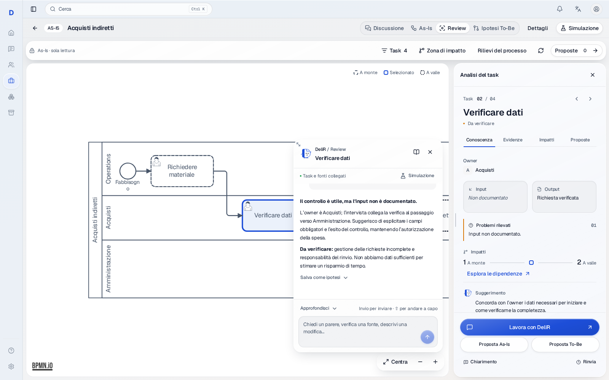

# Process Review — prima versione

As-Is descrive, Review interpreta, To-Be raccoglie le ipotesi di trasformazione.

La nuova vista Review ispeziona il modello salvato senza introdurre comandi di
modifica del diagramma. Selezionare un task apre una scheda breve ancorata al
nodo e un inspector con Overview, Evidenze, Impatti e Azioni. La scheda minima
contiene owner, input, output, problemi rilevati, impatti e suggerimento.

## Interazione e mascotte

Una piccola mascotte SVG appare nella bolla contestuale. Compie un giro breve
quando cambia il task selezionato o viene attivata; il movimento termina e
rispetta `prefers-reduced-motion`. Il canvas conserva zoom e posizione durante
la navigazione dei tab e il cambio del focus sulle dipendenze. Su schermi
compatti il dettaglio occupa il pannello di lavoro; chiuderlo restituisce il
canvas e il focus alla selezione dei task.

Le quattro azioni sono Mostra evidenze, Chiedi chiarimento, Proponi modifica e
Ignora per ora. Le ultime tre registrano un'azione persistente. Chiedi
chiarimento registra la domanda per il consulente: questa versione non invia
messaggi e non esegue chiamate a un agente. Le candidate change compaiono nella
vista To-Be come ipotesi, senza applicare automaticamente modifiche al modello.

## Design system

Il layout riusa `CanvasWorkspaceShell`, `WorkspaceCommandBar`,
`WorkspaceInspector`, `WorkspaceDisclosure`, `Surface` e le primitive UI
esistenti. Palette, font, materiali, spaziatura e motion restano quelli del
[Satin design system](satin-design-system.md).

Quattro ruoli in `frontend/styles/tokens/semantic.css` risolvono su token
semantici esistenti, mantenendo la catena verso i primitive token:

| Ruolo Review | Token esistente |
| --- | --- |
| `--review-color-selected` | `--color-action-primary` |
| `--review-surface-selected` | `--color-surface-selected` |
| `--review-color-upstream` | `--color-text-secondary` |
| `--review-color-downstream` | `--color-status-info` |

Le dipendenze hanno anche bordi tratteggiati/punteggiati e una legenda. I task
sono raggiungibili dalla lista con ricerca, senza dipendere dall'interazione
con l'SVG. Dialog e inspector gestiscono il ritorno del focus.

## Fonti, impatti e persistenza

Owner, input e output provengono dal piano canonico tramite riferimenti esatti
del compilatore; l'owner può essere letto anche dalla lane BPMN. I dati mancanti
restano dichiarati come non documentati. Le evidenze usano la provenienza
esistente; i rilievi generali rimangono distinti dall'analisi del singolo nodo.

La zona di impatto segue sequence flow, gateway, rami e cicli; collega inoltre
le associazioni documentali presenti nel BPMN. Controlli e regole sono collegati
tramite gli identificativi del piano. È un perimetro di dipendenza strutturale,
non una previsione dei tempi o una diagnosi misurata di colli di bottiglia.
Il pannello consente di aprire la simulazione esistente per approfondire.

`GET /v1/workspace/processes/{id}/impact-review` legge XML salvato, piano e
registro delle azioni. `POST .../impact-review/actions` aggiunge un'azione
tenant-scoped con UUID idempotente, autore e revisione della base. Una base
modificata restituisce 409 e conserva il testo nel dialog per la consultazione.
Il salvataggio blocca le righe della base durante la verifica e non aggiorna
XML o piano. La migrazione workspace `0029_impact_review_actions` aggiunge la
tabella con cancellazione a cascata del processo.

## Schermate del prodotto

Schermate generate da Playwright sulla vera UI con API simulate e dati
completamente sintetici. Non documentano un processo di un cliente.

- [Overview desktop e mascotte](process-review/overview-desktop.png)
- [Impatti desktop](process-review/impacts-desktop.png)
- [Evidenze desktop](process-review/evidence-desktop.png)
- [Ipotesi To-Be desktop](process-review/tobe-desktop.png)
- [Canvas mobile e mascotte](process-review/mascot-mobile.png)
- [Overview mobile](process-review/overview-mobile.png)

## Verifica

Verifiche locali: lint, TypeScript, build produzione, Ruff e mypy; 29 test unit
frontend su parser/modello Review e viewport BPMN; 8 test backend con Postgres
isolato; 6 scenari Playwright su Chromium desktop e mobile, con Axe su Overview,
dialog e To-Be. I controlli coprono persistenza, isolamento tenant, revisioni
obsolete, idempotenza, assenza di mutazioni As-Is, errori delle evidenze, focus,
layout compatto e movimento ridotto. Migrazione verificata su database nuovo e
con downgrade/upgrade della nuova revisione. La matrice Safari non è stata
eseguita in questa sessione.

Skill locali applicate: `frontend-dev-guidelines`, `react-ui-patterns`,
`ui-ux-designer`, `ui-ux-pro-max`, `tailwind-design-system`,
`ui-visual-validator`, `accessibility-compliance-accessibility-audit`, secondo
il routing di `AGENTS.md`.
