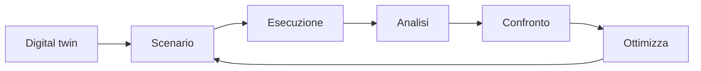

# DeliR Simulation — perimetro funzionale e proposta UX

Data: 2026-10-02

Stato: caratteristiche funzionali richieste da Sohay; architettura UX e criteri di accettazione proposti, da affinare insieme. Il documento non attesta implementazione o rilascio delle funzioni.

## Intento di prodotto

Il simulatore deve permettere di configurare un modello, comprenderne comportamento e limiti, confrontare alternative e sostenere una decisione operativa. La profondità del motore deve essere accessibile attraverso configurazione progressiva, provenienza leggibile dei parametri e risultati contestuali sul BPMN.

Il materiale caricato da Sohay fissa il catalogo funzionale di riferimento. Le immagini ProcessMind guidano densità, gerarchia e organizzazione dei pannelli; non vengono copiate. Le affermazioni di parity nel documento originale sono obiettivi di prodotto, non verifiche comparative già eseguite.

## Catalogo funzionale richiesto

| Ambito | Capacità | Punto di accesso UX proposto |
| --- | --- | --- |
| Flow | routing BPMN, XOR/AND/OR, loop, probabilità, boundary/event behavior | processo e inspector; report di compatibilità |
| Demand | arrival rate, calendari di arrivo, stagionalità, distribuzioni | scenario: domanda |
| Time | processing time, waiting time, delays e distribuzioni | inspector attività e dashboard tempi |
| Resources | persone, ruoli, macchine, sistemi, capacità | scenario: risorse e inspector |
| Queues | FIFO, LIFO, priorità; regole custom da definire | inspector: code, impostazioni avanzate |
| Calendars | turni, weekend, ferie, pause e disponibilità | calendario risorse e calendario arrivi separati |
| Costs | costo orario risorse, costo attività, costi fissi/variabili | scenario e risultati economici |
| Capacity | utilizzo, saturazione, lunghezza code e WIP | dashboard e sovrapposizioni sul modello |
| Performance | throughput, cycle time, waiting time e SLA | dashboard dinamica e risultati dell'esperimento |
| Scenarios | baseline AS-IS, TO-BE e alternative multiple | selettore scenari e confronto |
| Experimentation | repliche, seed, warm-up e orizzonte | configurazione esperimento e dettaglio risultati |
| Output | event log sintetico | risultati, dettaglio casi e analisi condivisa |
| Validation | simulato vs storico | validazione digital twin e dashboard confronto |
| Optimization | ricerca configurazioni migliori | modalità Ottimizza con obiettivi e vincoli |
| AI | configurazione, generazione scenari e spiegazione risultati | azioni contestuali con anteprima |

Questa tabella definisce il perimetro funzionale desiderato. La sequenza di consegna non riduce il catalogo: distingue dipendenze e verifica del supporto effettivo.

## Navigazione e area di lavoro

Flusso principale proposto:

Contesto persistente: processo/versione, scenario/revisione, esperimento, esecuzione selezionata, filtri e tempo simulato. Le viste dell'analisi sono Processo e Dashboard; il cambio vista mantiene questo contesto.

Consultant View e Operations View sono prospettive sullo stesso stato. La prima rende immediatamente accessibili assunzioni, provenienza, distribuzioni, qualità dati, intervalli, validazione ed export. La seconda porta in primo piano problema, cause misurate, code, SLA, costo e possibili esperimenti. Il cambio prospettiva non modifica lo scenario né avvia un run.

## Digital twin: configurare dai dati con revisione

Sorgenti applicative previste: BPMN, event log, interviste, documenti e memoria di processo. Le sorgenti producono candidati di parametro con fonte, metodo, unità, ambito, assunzioni e qualità della stima. Questa specifica conserva soltanto descrizioni di prodotto; non include dati grezzi o identificativi personali.

La schermata presenta una checklist: arrivi, durate attività, probabilità gateway, risorse, calendari, costi, regole di coda, attributi caso e ritardi aggiuntivi. Stato per riga: disponibile, da rivedere, mancante o incompatibile. Azioni sui candidati: approva, modifica, rifiuta; modificare conserva la proposta e la provenienza originali.

Il readiness score richiede una formula documentata e l'elenco delle cause sottostanti. Un parametro mancante e una semantica BPMN incompatibile sono condizioni distinte. Una percentuale elevata non annulla un'incompatibilità bloccante.

## Inspector attività e provenienza

Clic su attività: nome, lavorazione, attesa, risorse/capacità, utilizzo, coda, costo e fonti. I parametri modificabili sono separati dai risultati misurati; modificare una durata crea una revisione dello scenario, non altera il run già concluso.

Origini richieste: Observed, Inferred, Declared, Estimated, Manual. L'origine è distinta dalla confidenza. Ogni parametro collega riferimento alla fonte, metodo, numero di osservazioni quando disponibile, assunzioni e revisione. La confidenza qualitativa del parametro è distinta dall'intervallo statistico di un KPI.

Il dettaglio contiene un'azione per aggiungere un grafico dell'attività al canvas o alla dashboard. Selezionare apre dettagli; filtrare richiede un'azione esplicita e produce un chip rimovibile.

## Scenario Workspace

AS-IS e alternative sono accessibili dal selettore superiore; ogni scenario mostra revisione e differenze rispetto alla baseline. Nuovo scenario, duplica e modifica conservano la tracciabilità.

Una richiesta AI come «aggiungi una persona alle approvazioni» produce prima un'anteprima della modifica di capacità, risorse, calendario e costi interessati. L'utente applica la modifica ed esegue l'esperimento. Gli effetti vengono misurati dal motore; il testo AI non rappresenta una previsione già verificata.

Configurazione progressiva: prima domanda, tempi e risorse; poi calendari, costi, routing e code; dettagli sperimentali accessibili senza esporre tutti i campi sulla prima schermata.

## Esecuzione, replay e dashboard dinamica

Distinguere tre stati: calcolo dell'esperimento, riproduzione di un'esecuzione e risultati finali. I comandi devono specificare se fermano il calcolo o mettono in pausa il replay. La possibilità di cancellare un job va verificata nel contratto backend.

Durante il replay, tutti i KPI etichettati «al tempo corrente», le serie visibili, le code e i token derivano dalla stessa esecuzione e dallo stesso istante. I risultati finali sono accessibili in una sezione esplicitamente etichettata e non compaiono come metriche correnti.

Pausa e seek mantengono coerenza tra modello e dashboard; avanzamento, ritorno indietro e cambio vista non introducono dati futuri. Il futuro eventualmente mostrato come previsione/storico completo è una modalità esplicita distinta. La velocità del playback non cambia le condizioni dello scenario.

L'animazione può usare un campione di casi per leggibilità: la UI indica il campionamento. KPI globali e statistiche di confronto usano la popolazione completa dichiarata, non il numero di token visibili. Gli aggregati temporali indicano la granularità dei bucket.

Prima dashboard: casi generati/attivi/conclusi, attraversamento, lavorazione, attesa, costo/caso, throughput, SLA, WIP e principale area di congestione. La disposizione deve restare leggibile con dati mancanti. La pressione istantanea su una coda è distinta dalla diagnosi finale di collo di bottiglia.

Grafici aggiornati con categorie, layout e scale stabili quando possibile. Evitare riordinamenti continui, auto-zoom e annunci ad ogni tick agli screen reader.

## Libreria e composizione delle analisi

Widget richiesti: barre, colonne, linee, area, torta, anello, barre radiali, indicatore, KPI/testo, Markdown, riepilogo AI, riquadro HTML, filtri, selettori ed elenchi casi. Preset per casi, eventi, tempi, code, risorse e costi.

Builder: tela vuota o modello preconfigurato; gruppi con titolo/descrizione; righe e griglia; aggiunta, spostamento, ridimensionamento, duplicazione, eliminazione, riordino e salvataggio. Layout salvato separatamente da scenario e risultati. Operazioni da tastiera e pulsanti come alternativa al drag and drop.

Inspector widget: Generale; Metrica; Filtri e ordinamento; Etichette; Stile. Supporto a aggregazioni, metriche secondarie, soglie, unità, Da/A, tutti/attivi/conclusi, filtri locali, eredità filtri globali e temporali, Top N, Altri e valori mancanti. Badge per widget che ignorano filtri condivisi. Attributi selezionabili solo se disponibili.

Sul canvas: posizione/dimensioni persistenti, interruttore generale di visibilità e collegamenti analitici tratteggiati distinti dai flussi BPMN. Pool/lane come contenimento dove supportato; i widget analitici non diventano attività eseguibili.

## Definizioni delle metriche

Attraversamento: caso o intervallo completo Da/A. Lavorazione e attesa: per occorrenza di attività. Transizione: passaggio tra elementi. Per casi aperti mostrare età corrente separatamente dalle durate finali. Nessuna osservazione appare come valore mancante, non zero.

Aggregazioni applicabili: conteggi/distinti, somme, media, min/max, mediana, percentili e rapporti. Mostrare unità, popolazione, osservazioni e denominatore delle percentuali. Con parallelismo non imporre attraversamento = somma di lavorazione e attesa.

Definire costo per caso, utilizzo e throughput con finestra, calendario e denominatore espliciti. Distinguere esito SLA dei conclusi da rischio sui casi attivi. Un eventuale punteggio salute richiede una formula; conformità, qualità modello e CO2e richiedono dati/valutazioni propri.

Warm-up influenza lo stato del sistema ma resta fuori dalla finestra di misura secondo una policy esplicita. Dichiarare il trattamento dei casi incompleti al termine. Repliche, seed, fallimenti e intervalli di confidenza restano consultabili.

## Markdown, formule e AI

Testi formattati e formule dinamiche condividono ambito e tempo del widget. Editor con variabili, funzioni, esempi, validazione e anteprima. Sintassi proposta: `${metric}`, `${total - metric}`, `${formatPercentage(metric / total)}`, `${formatDuration(metric)}`. Definire il totale prima dei filtri per lo stesso istante/esecuzione, e gestire denominatore zero.

Funzioni iniziali proposte: round, formatPercentage, formatDuration, formatDate. Le formule non eseguono JavaScript arbitrario; eventuale HTML isolato dal contesto applicativo. Il riepilogo AI indica fonte, filtri, esecuzione e istante; mostra quando è precedente ai dati correnti.

## Confronto, validazione e ottimizzazione

Tabella baseline/scenari con KPI, unità, delta assoluto/relativo, repliche e incertezza. Per tassi distinguere punti percentuali da variazioni percentuali. Confronti richiedono finestre, domanda, warm-up e criteri compatibili; le differenze fanno parte della lettura.

Validazione contro log osservato: distribuzioni di durata, attese/lavorazione, throughput, frequenze e percorsi; evidenziare scostamenti e parametri da rivedere. Auto-configurato e validato sono stati diversi.

Ottimizza: obiettivi, vincoli, variabili modificabili, intervalli ammessi, budget di esperimenti e progresso. Valutare allocazioni, automazione, routing, soglie, batch, turni, capacità e modifiche del modello nei limiti del supporto verificato. Ogni candidato confrontabile viene simulato. Presentare alternative efficienti per costo, equilibrio e velocità con assunzioni e differenze BPMN; niente garanzia implicita di ottimo globale.

Suggerimenti Operations sono esperimenti da provare. Le interpretazioni collegano evidenze, incertezza, benefici, costi e spostamento di eventuali vincoli.

## Riscontro iniziale del repository

Ispezione statica selettiva; nessuna verifica runtime eseguita in questo passaggio:

- `SimulationLayout.tsx` espone overview, scenario, replay, dashboard, compare, heatmap e insights.
- `ReplayGate.tsx` abilita il replay su run conclusi; per run pending mostra lo stato di esecuzione. Non dimostra streaming live dal motore.
- `useReplay.ts` crea/distrugge un'istanza engine legata al mount. Il clock condiviso persistente attraverso cambio vista richiede verifica e adeguamento.
- `SimulationDashboardPage.tsx` legge frame correnti per attività/risorse, ma usa summary finale e picco dell'intera serie nella headline. La UX deve rendere espliciti questi ambiti.
- `TimeSeriesChart.tsx` riceve l'intera serie e applica una copertura visiva al futuro. La coerenza al tempo corrente va verificata anche su tooltip e accessibilità.
- `simulationTypes.ts` distingue artifact campionato, serie e summary; la provenienza attuale copre origini interview/ai_inferred per duration/branching. Il catalogo richiesto è più ampio.
- `bpmn_normalizer.py` rimuove boundary event, tratta subprocess come task black box, riscrive complex gateway e elimina eventi intermedi tramite pass-through. Serve visibilità delle trasformazioni e verifica della semantica richiesta.

Prosimos resta il motore di riferimento dell'integrazione esistente. Le capacità richieste non si presumono supportate solo perché un modello viene accettato. Il report di compatibilità precede il run e collega elementi preservati/approssimati/rimossi/bloccati al possibile impatto.

## Consegna e accettazione

1. Validare navigazione, wireframe, prospettive e contratto delle metriche.
2. Consolidare compatibilità, scenario/provenienza, distribuzioni, calendari ed esperimenti riproducibili.
3. Implementare area analisi con clock condiviso e distinzione temporale dei risultati.
4. Implementare builder, filtri, widget canvas, Markdown ed espressioni.
5. Completare auto-configurazione, validazione, confronto e ottimizzazione secondo dipendenze del motore.

Criteri trasversali: nessun risultato futuro etichettato corrente; pausa/seek e cambio vista coerenti; salvataggio/revisione verificabili; dati mancanti corretti; comparazioni statistiche trasparenti; focus e tastiera; grafici con alternativa dati; movimento ridotto; visual QA desktop/mobile; prestazioni su processi rappresentativi.

Stile proposto: superfici operative dense, pannelli richiudibili, gerarchia chiara, bordi discreti, componenti/token DeliR, colore accompagnato da testo/icona. Su schermi piccoli KPI impilati e dettaglio su richiesta.

## Provenienza e documenti collegati

- Requisiti di dashboard: materiale, screenshot e richieste di Sohay nella chat del 2026-10-02.
- Perimetro del simulatore: allegato `874a9b2a-5c0b-4821-8b86-fe81c9df1889/Testo incollato.txt`, presentato da Sohay come caratteristiche del simulatore di base. I valori numerici del materiale sono esempi, non risultati misurati di DeliR.
- [Integrazione Prosimos](../simulation-prosimos.md).

La sintesi UX è una proposta generata dall'assistente. È materiale adatto a una futura nota di strategia prodotto nella StartupWiki, mantenendo fonte e stato di conferma; nessun aggiornamento della memoria personale o del vault è stato effettuato in questo passaggio.

## Implementazione della dashboard — ottobre 2026

Consegnato nel branch `codex/simulation-enterprise-ux`:

- Clock condiviso fra processo e dashboard, con riproduzione, pausa, seek e reset al cambio run.
- KPI e serie limitati all’istante selezionato; risultati dell’intero esperimento esplicitamente separati.
- Undici tipi di widget, configurazione, sezioni, duplicazione, ordine tramite drag o tastiera e larghezza metà/intera riga.
- Analisi associate alle attività BPMN, selezione attività da tastiera, spostamento mouse/tastiera, dimensionamento e visibilità collettiva.
- Markdown e formule limitate: aritmetica, `round`, `formatPercentage`, `formatDuration`, `formatDate`. Le espressioni metriche devono restituire numeri non negativi nella stessa unità della metrica di origine.
- Persistenza locale della sola configurazione per progetto/processo, con validazione e recupero visibile degli errori; nessun event log salvato in localStorage.
- Alternative tabellari ai grafici, gestione del focus, layout responsive e verifiche WCAG con Axe.

Limiti espliciti: il backend esistente calcola il run prima di produrre l’artifact di replay; non è stato aggiunto streaming live. La configurazione delle dashboard è salvata sul dispositivo, senza condivisione server. HTML eseguibile e riepiloghi AI non sono stati introdotti. Il catalogo completo del motore resta un requisito distinto da questa consegna UI.

### Revisione e verifica della consegna

Revisione del diff effettuata durante ogni commit e sul confronto finale con `main`: proprietà del clock e teardown, separazione dati correnti/finali, limiti del parser, migrazione dei layout precedenti, errori di storage, focus, configurazione per progetto/processo e isolamento delle sovrapposizioni BPMN. I testi Markdown non eseguono HTML né caricano immagini remote, coerentemente con le note dell’app.

Verifiche locali:

- `npm --prefix frontend run typecheck` e `npm --prefix frontend run lint`: superati.
- Suite frontend: 47 file e 281 test superati prima dell’ultima estensione numerica; il modulo aggiornato delle espressioni passa tutti i suoi 7 test.
- `npm run check:bundle`: build e budget esistente superati, senza aumentare i limiti.
- `npx playwright test --config playwright.simulation.config.ts --project=chromium --project=webkit --project=mobile-chrome --project=mobile-safari --workers=1`: 28 test superati.
- Verifica aggiuntiva della navigazione attiva, accessibilità e controlli mobili: altri 8 test superati sui quattro browser/viewport.
- Screenshot desktop/mobile esaminati manualmente; Axe senza violazioni WCAG A/AA nel workspace testato. I test usano dati sintetici e non attestano nuove capacità del backend.

La PR include la matrice Playwright nella CI già esistente. Il merge richiede la verifica dei risultati della CI sul commit finale.

Verifica successiva dei grafici circolari: quattro test dedicati superati, uno per browser/viewport, con tutte le undici tipologie di widget e legende controllabili senza hover. La suite UI della simulazione comprende ora 32 test nella matrice completa.
