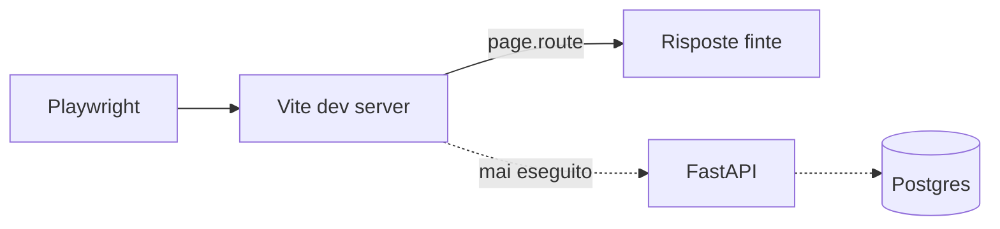

# Fragilità del prodotto — audit end-to-end

Fotografia del 2026-09-24. **Non si aggiorna**: è la base di partenza contro cui
si misura il lavoro. Lo stato dei lavori sta in
[`fragilita-status.md`](fragilita-status.md).

Letti: `backend/` (210 file Python), `frontend/src` (262 file TypeScript),
`e2e/`, CI, `ops/`. Il ramo `feat/notifications-feed` era 20 commit dietro
`main`; i file chiave sono stati diffati e i difetti valgono su entrambi.

Il percorso felice regge. Cede su tre cose: l'isolamento fra spazi di lavoro non
esiste davvero, il lavoro si perde in silenzio, e nessun test attraversa
frontend, backend e database insieme.

---

## Backend

### B1 — Il tenant arriva da un header, non dalla credenziale (Bloccante)

`backend/security.py:82`, `backend/app.py:78`.

`normalize_tenant_id(x_delir_tenant_id)` prende lo spazio di lavoro da
`X-DeliR-Tenant-ID` e non lo confronta mai con il bearer. Chi ha il token cambia
header e legge un altro spazio. Il token sta nel bundle frontend
(`frontend/src/lib/security.ts:16`, via `VITE_*` o `window`), quindi ce l'ha ogni
utente del prodotto; `appendAuthQueryParams` lo mette anche in querystring, dove
finisce negli access log dei proxy. Unica difesa: `DELIR_ALLOWED_TENANT_IDS`, che
è una lista globale e non una proprietà della credenziale.

### B2 — Autenticazione spenta di default (Bloccante)

`backend/settings.py:127`.

`delir_auth_enabled: False` porta con sé CORS `*` (`backend/app.py:56`) e
`is_admin=True` per chiunque (`backend/security.py:85`), cancellazioni comprese.
Un deploy che parte con i default è senza porta e non lo dice.

### B3 — Memoria di un consulente solo (Bloccante)

`settings.default_consultant_id`, 20 riferimenti: `backend/memory/scope.py`,
`backend/memory/gateway.py:835`, `backend/agents/primary_scope.py:92`,
`backend/memory/procedural/playbook_context.py:45`.

Due consulenti nello stesso deploy condividono memoria semantica, episodica e
procedurale: i fatti di uno rientrano nella chat dell'altro.

### B4 — Architettura mono-processo, non dichiarata (Alto)

`backend/services/agent_runtime.py:114` (`_THREAD_LOCKS` in-process),
`backend/workers/supervisor.py` (worker in-process),
`backend/api/routes/simulation.py:56` (simulazione via `BackgroundTasks`).

Un secondo worker uvicorn fa girare due turni sullo stesso thread in parallelo:
checkpoint corrotto. Niente nel codice lo impedisce né lo segnala.

### B5 — 73 handler su 76 sono `def` sync (Alto)

`backend/api/routes/`.

Girano nel threadpool anyio, 40 posti, mai tunato. Un turno di chat ne tiene uno
fino a 90s (`agent_run_deadline_seconds`), una simulazione fino a 900s
(`prosimos_timeout_seconds`). A ~40 turni concorrenti l'API si ferma, `/health`
compreso: il health check è rosso proprio quando serve leggerlo.

### B6 — Leak di memoria certo (Alto)

`backend/services/trace_recorder.py:79`.

`_TRACE_EVENTS` e `_TRACE_STARTS` sono dizionari di modulo mai potati:
`clear_trace` è definita e non è chiamata da nessuna parte (grep su `backend/` e
`tests/`). Ogni turno accumula eventi con payload finché il processo vive.

### B7 — La risposta si perde se il client cade (Bloccante)

`backend/api/routes/chat.py:352`.

L'assistant si salva solo dopo che il generatore è arrivato in fondo. Una
disconnessione alza `GeneratorExit`, che deriva da `BaseException` e quindi
l'`except Exception` di riga 371 non prende: il messaggio utente resta orfano in
database e la risposta è persa. Nessun resume: un F5 a metà turno cancella il
lavoro.

### B8 — Run di simulazione bloccato per sempre (Alto)

`backend/simulation/storage.py:62`.

`find_active_run_by_key` cerca `status == "pending"` per l'idempotenza, e non
esiste nessuno sweeper. Un crash o un deploy durante un run lascia quello
scenario `pending` in eterno, e da quel momento non si può più rilanciare; il
frontend polla ogni 5s all'infinito (`frontend/src/features/process/api.ts:238`).

### B9 — `str(exc)` verso il client in 20 punti (Medio)

`backend/api/routes/chat.py:110`, `:247`, `:249`, `:372`;
`backend/api/routes/workspace.py` (10 punti); `backend/api/errors.py:131`.

L'eccezione Python, con nomi di provider, SQL o percorsi di file, arriva in
interfaccia parola per parola.

### B10 — Spesa LLM senza tetto (Alto)

`backend/llm/gateway.py`.

Nessun rate limit nel repo. Il gateway registra e pretende un'operazione aperta,
ma non nega: nessun `budget`, nessun `cap`.
[`llm-spend-status.md`](llm-spend-status.md) dà P0.4 (chiavi e progetti separati
con tetto) come non iniziato. `POST /v1/evals/observability-smoke` non è
riservato agli amministratori.

### B11 — La traccia non è legata al tenant (Medio)

`backend/api/routes/observability.py`.

`get_observability_trace` serve qualsiasi `trace_id` a qualsiasi tenant, e il
`trace_id` viene consegnato al client nell'evento `start` dello stream.

### B12 — Liste senza `LIMIT` (Medio)

`backend/workspace_database.py:201`, `:332`, `:602`, `:1809`, `:3031`.

Clienti, progetti, processi, fonti e archivio senza paginazione: una richiesta
tira giù il workspace intero.

---

## UI

Le schermate del workspace (clienti, progetti, archivio, modelli, home) sono
mature: caricamento, errore e vuoto ci sono tutti. La sezione Simulazione, la più
nuova, non ne ha quasi nessuno, e non esiste una rete sotto il render.

### U1 — Nessun ErrorBoundary, nessun `errorElement` (Bloccante)

`frontend/src/app/router.tsx` e tutto `frontend/src`.

Un throw in render è schermo bianco totale. L'unico recupero è F5, che per B7
costa il turno in corso.

### U2 — Zero code splitting (Medio)

`frontend/src/app/router.tsx`.

Nessun `React.lazy`. `bpmn-js`, `bpmn-js-properties-panel`,
`bpmn-js-token-simulation`, `recharts` e `react-markdown` stanno nel bundle
iniziale: chi apre Clienti scarica il canvas BPMN.

### U3 — La Simulazione mostra zeri al posto di «nessun dato» (Bloccante)

`frontend/src/features/process/simulation/pages/SimulationDashboardPage.tsx:194`.

`Number(summary?.cycle?.avg ?? 0)`: un summary mancante diventa cycle time 0,
costo 0, p95 0. Replay, Dashboard e Overview non hanno né stato di caricamento né
stato d'errore. In un prodotto di consulenza, numeri finti sono il difetto
peggiore della lista.

### U4 — 110 stringhe italiane scritte nel codice (Alto)

`frontend/src/features/chat/ChatExperience.tsx:161-184`,
`frontend/src/features/chat/components/ChatComposer.tsx:323-520`.

`locales/it` e `locales/en` sono allineate al 100% (922 chiavi, 0 mancanti), ma
la chat non passa da i18next: in inglese resta in italiano. E parla da sistema
(«Diarizzazione non riuscita», «Live transcript attivo»), lo stesso vocabolario
che `record_product_language` conta nelle risposte del modello e nessuno conta
nell'interfaccia.

### U5 — Accessibilità verificata su una pagina sola (Alto)

`e2e/accessibility.spec.ts`.

Axe gira solo sulla HomePage. Studio, canvas, dialoghi, simulazione e chat non
sono mai stati scansionati. Nessuno skip link.

### U6 — L'errore del backend si legge come sta (Medio)

`frontend/src/lib/http.ts:98`,
`frontend/src/features/chat/stream/chatRunStore.ts:307`.

`httpErrorMessage` prende `detail` e lo concatena: «Non sono riuscito a
completare questa richiesta» seguito dall'eccezione Python.

### U7 — PWA dichiarata, PWA assente (Medio)

`frontend/`.

Nessun manifest, nessun service worker, nessun `vite-plugin-pwa`. Niente
offline, niente installazione.

---

## UX

L'Archivio chiede conferma prima di cancellare, con un dialogo dedicato. La chat,
che si usa dieci volte più spesso, no. Le altre quattro sono promesse che il
prodotto fa e non mantiene.

### X1 — Cancellazione senza rete (Alto)

`frontend/src/features/chat/ChatExperience.tsx:163`.

«Cronologia eliminata» parte al click: nessuna conferma, nessun annulla. Un click
cancella tutte le conversazioni. L'Archivio usa `RecordLifecycleDialog` per molto
meno: due pesi nello stesso prodotto.

### X2 — Clienti è un elenco che non si apre (Alto)

`frontend/src/app/routes.ts:9`, `frontend/src/app/router.tsx`.

`ROUTES.clients.detail` esiste e non è montato in nessuna rotta. Un cliente non ha
una sua schermata: niente storico, niente progetti suoi, niente contesto.

### X3 — URL sbagliato, rimando muto (Medio)

`frontend/src/app/router.tsx:64`.

`path: "*"` rimanda a `/projects`. Un deep link vecchio o rotto atterra su un
elenco senza dire niente, e il tasto indietro non torna.

### X4 — La ricerca globale cerca il cliente per nome (Medio)

`frontend/src/features/search/api.ts:56`.

Naviga con `f_client=title`, mentre il resto del prodotto ormai confronta per id
(commit `34c24f3`). Un rinvio senza `projectId` cade sull'elenco generico senza
spiegazione.

### X5 — Nessun tetto alle simulazioni concorrenti (Medio)

`ops/prosimos/README.md`.

Prosimos regge sei run in parallelo, DeliR non lo sa. La settima aspetta in
silenzio fino a 900s e poi fallisce.

---

## Verifica

### V1 — La suite `e2e/` non attraversa il backend (Bloccante)

`playwright.config.ts:83`, `.github/workflows/ci.yml`.

`webServer` avvia solo il frontend, e ogni spec sostituisce il backend con
`page.route(API/**)`. Il CI lo dichiara per iscritto: «Frontend-only e2e. No
backend». Quindi B7, B8, B9 e B11 non sono osservabili da nessun test: si
vedranno in demo.

### V2 — Visual e Lighthouse non bloccano il merge (Medio)

`.github/workflows/ci.yml`.

Visual regression e Lighthouse sono opt-in (`RUN_VISUAL`, `RUN_LIGHTHOUSE`) e non
stanno fra i job richiesti da «All CI checks passed». 12 spec, circa 37 test, su
shell, chat e processo: simulazione e canvas reale sono scoperti.
